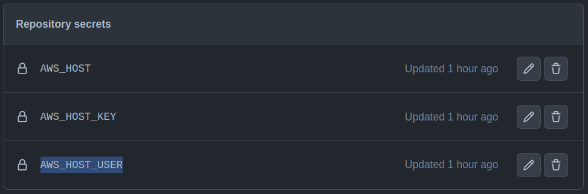
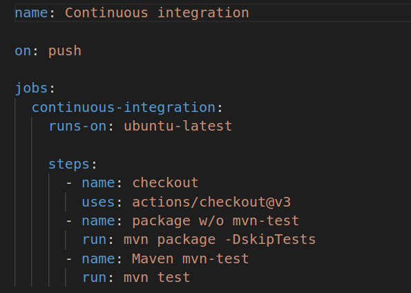
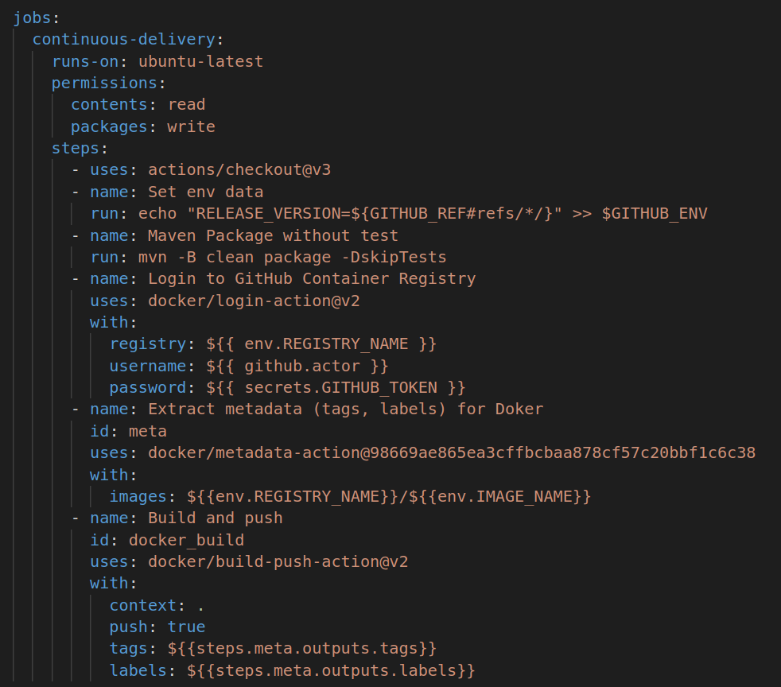
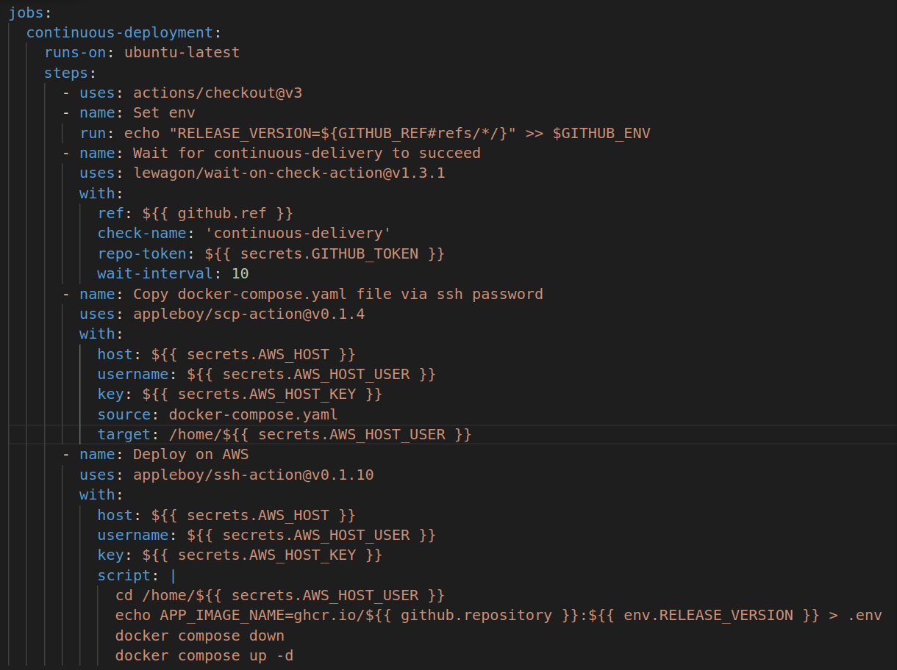
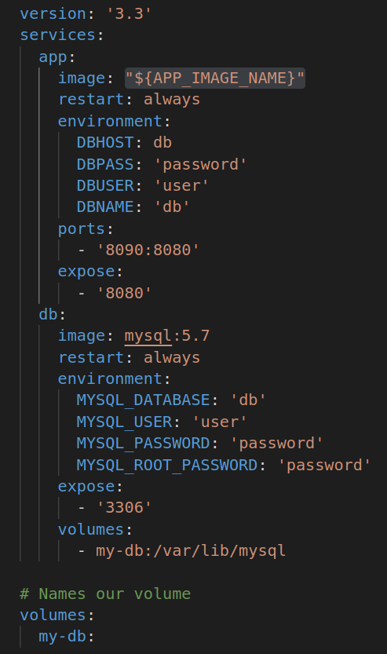

# Solución Tarea día 8 - Herramientas para el desarrollo de software en la nube 2023

Aitor Iturrioz & Pablo Rubio

Este repositorio contiene la solución al ejercicio planteado como tarea del día 8. Para que el código sea plenamente funcional, lo único que hay que hacer es definir las siguientes tres variables en "Settings" -> "Secrets and variables" -> "Actions" -> "Repository Secrets":

- **AWS_HOST**: donde se debe indicar la URL de conexión que establece la máquina EC2 de AWS (por ejemplo: 'ec2-52-55-9-68.compute-1.amazonaws.com')
- **AWS_HOST_KEY**: donde se debe indicar la clave privada de conexión SSH con la máquina EC2 de AWS
- **AWS_HOST_USER**: donde se debe indicar el nombre de usuario de la máquina EC2 de AWS (si la máquina virtual está basada en Ubuntu, el nombre de usuario será 'ubuntu')



Para solucionar la tarea se han desarrollado tres actions diferentes, uno para cada uno de los tres pasos de un pipeline CI/CD/CD:

- [continuous-integration.yaml](.github/workflows/continuous-integration.yaml)
- [continuous-delivery.yaml](.github/workflows/continuous-delivery.yaml)
- [continuous-deployment.yaml](.github/workflows/continuous-deployment.yaml)

> **Nota**: es necesario que la máquina virtual donde se realizará el deploy final tenga Docker instalado. Para ello, se pueden seguir las instrucciones detalladas en el fichero [docker-intallation-steps.txt](docker-installation-steps.txt)

## Continuous integration



Tal y como se ha visto en clase, este action se ejecuta cada vez que se hace un push al repositorio (aunque se podría cambiar a ```on: pull_request```) y lo único que hace es generar el .jar de la aplicación (```mvn package -DskipTests```) y comprobar que todos los tests se ejecutan correctamente (```mvn test```).

## Continuous delivery



El job de este action genera la imagen Docker de la aplicación cada vez que se crea un nuevo release y la almacena en el GitHub Container Registry (ghcr.io) del repositorio. Los tags de la aplicación serán 'latest' y el de la release generada (vX.X, por ejemplo, v0.2).

## Continuous deployment



Finalmente, en el continuous deploymente se reutilizará la imagen Docker generada en el continuous delivery, de forma que en la máquina virtual EC2 no haya que ejecutar ningún ```docker build ...```. Para ello, se hará uso de tres actions diferentes:

### lewagon/wait-on-check-action

[Documentación oficial](https://github.com/lewagon/wait-on-check-action)

Este action permite detener la ejecución de un workflow hasta que otro workflow haya completado la ejecución. ¿Por qué? Porque no es conveniente que el continuous deployment sea ejecutado hasta que el continuous delivery esté listo.

El parámetro más importante de este action es ```check-name```, donde se indicará el nombre del **job** al que se debe esperar. En este caso es ```continuous-delivery```, ya que así se ha llamado al job principal (y único) del action [Continuous Delivery](.github/workflows/continuous-delivery.yaml).

### appleboy/scp-action

[Documentación oficial](https://github.com/appleboy/scp-action)

Este action permite copiar ficheros (o carpetas) desde nuestro repositorio a cualquier ordenador remoto, siempre que éste tenga una IP pública y tenga habilitada la conexión SSH. La conexión con el servidor se establecerá a través de las variables ```host```, ```username``` y ```key```, cuyos valores serán definidos a través de variables de entorno (secrets) de GitHub. En este caso, como se va hacer uso de la imagen Docker alojada en ghcr, el único fichero a copiar será el docker-compose.yaml (parámetro ```source```). El parámetro ```target``` establece la carpeta destino donde se copiará el fichero anterior.

### appleboy/ssh-action

[Documentación oficial](https://github.com/appleboy/ssh-action)

Finalmente, el tercer action permite ejecutar cualquier comando en una máquina remota a través de SSH. Tal y como ocurría con el action anterior, en este también será necesario definir las variables ```host```, ```username``` y ```key```, con el final de poder establecer una conexión SSH válida. Para definir qué versión del contenedor de la aplicación Java se va a ejecutar, se crea un fichero de texto llamado ```.env```, donde se almacena la variable ```APP_IMAGE_NAME```, cuyo valor contiene:

- Repositorio de imágenes Docker: ghcr.io
- Nombre de la imagen: bodiroga/tarea-dia-8-solucion (se establece a través de la variable ```${{github.repository}}```)
- Version de la imagen: por ejemplo, v0.2 (se establece a través de la variable ```${{env.RELEASE_VERSION}}```)

El comando ```docker compose``` sustituirá la variable ```APP_IMAGE_NAME``` presente en el docker-compose.yaml por el valor de la variable en el fichero ```.env```. De esta forma se asegura que la versión que se pondrá en producción sea la misma que la del release de GitHub.

## Docker Compose file



Con la idea de dotar de la mayor flexibilidad posible al [docker-compose.yaml](docker-compose.yaml), en el apartado ```image``` del servicio de la aplicación de Java no se ha definido ningún valor concreto, sino que se ha empleado una variable llamada ```${APP_IMAGE_NAME}```. El valor de esta variable se establecerá a través de un fichero ```.env``` cuando se ejecute una nueva versión a través del continuous deployment.